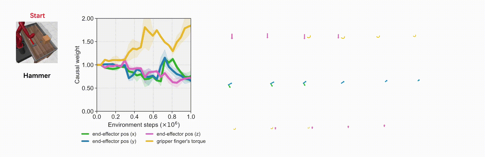

# ACE : Off-Policy Actor-Critic with Causality-Aware Entropy Regularization

<p align="center" style="font-size: 50px">
   <a href="https://arxiv.org/abs/2402.14528">[Paper]</a>&emsp;<a href="https://ace-rl.github.io/">[Project Website]</a>
</p>


This repository is the official PyTorch implementation of **ACE**. **ACE** is an advanced reinforcement learning algorithm that introduces causality-aware entropy regularization and a gradient-dormancy-guided reset mechanism to enhance exploration efficiency and prevent overfitting. **ACE** demonstrates significant performance improvements across a wide range of continuous control tasks, including locomotion and manipulation, surpassing popular model-free RL baselines.

<p align="center">
  <br><br>
</p>


# 🛠️ Installation Instructions

First, create a virtual environment and install all required packages. 
~~~
conda create -n ace python=3.8
pip install -r requirements.txt
~~~


## 💻 Code Usage

If you would like to run ACE on a standard version of a certain `task`, please use `main_causal.py` to train ACE policies.
~~~
python main_causal.py --env_name task
~~~
If you would like to run ACE on a sparse reward version of a certain `task`, please follow the command below.
~~~
python main_causal.py --env_name task --reward_type sparse
~~~

## 📝 Citation

If you use our method or code in your research, please consider citing the paper as follows:

```
@inproceedings{
ace,
title={ACE: Off-Policy Actor-Critic with Causality-Aware Entropy Regularization},
author={Tianying Ji, Yongyuan Liang, Yan Zeng, Yu Luo, Guowei Xu, Jiawei Guo, Ruijie Zheng, Furong Huang, Fuchun Sun, Huazhe Xu.},
booktitle={The Forty-first International Conference on Machine Learning},
year={2024},
url={https://arxiv.org/abs/2402.14528}
}
```

## 🙏 Acknowledgement

ACE is licensed under the MIT license. MuJoCo and DeepMind Control Suite are licensed under the Apache 2.0 license. 
